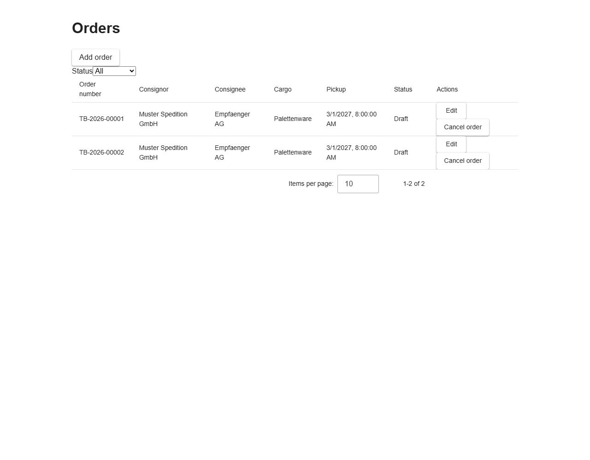
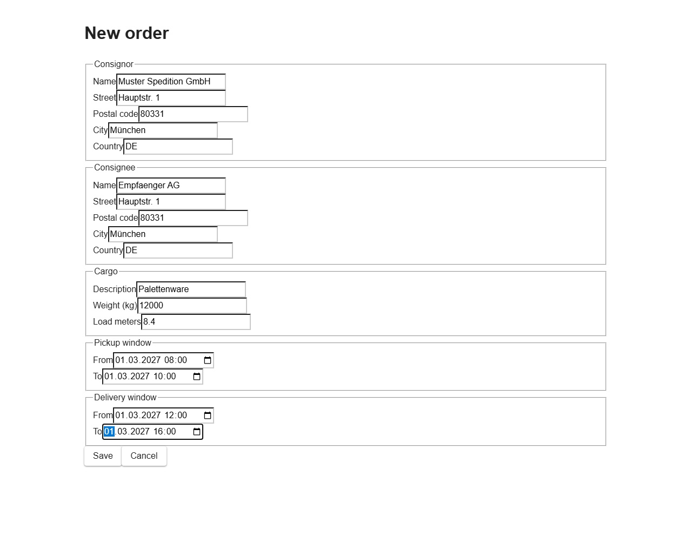

# Bedienung TransBrain.VueWeb (Vue)

Diese Anleitung beschreibt die Vue-Oberfläche von TransBrain (`src/TransBrain.VueWeb`,
Vuetify). Sie bietet denselben Funktionsumfang wie die Angular-Oberfläche gegen dieselbe
API — siehe `docs/BEDIENUNG_TRANSBRAIN_WEB.md` für die Angular-Variante. Wo sich das
Verhalten nicht unterscheidet, ist der Text hier bewusst wortgleich zu jener Anleitung.

Die Beschriftungen der Oberfläche selbst (Schaltflächen, Feldnamen, Fehlermeldungen) sind
auf Englisch, da die Anwendung noch nicht lokalisiert ist. Diese Anleitung ist auf Deutsch
verfasst, nennt aber die tatsächlichen englischen Beschriftungen, damit sie zu dem passt,
was auf dem Bildschirm zu sehen ist.

> **Achtung — Entwicklungsumgebung, keine Daten bleiben erhalten:** Bei jedem Neustart
> von `dotnet run --project src/TransBrain.AppHost` beginnt die Anwendung mit einer
> **leeren Datenbank**. Postgres und Keycloak haben in dieser Umgebung absichtlich kein
> dauerhaftes Datenlaufwerk — Postgres führt bei jedem Start alle Migrationen neu von
> Grund auf aus, und Keycloak importiert die Realm-Konfiguration erneut aus der Datei.
> Das macht jeden Start reproduzierbar, bedeutet aber auch: **Jedes Fahrzeug, jeder
> Fahrer und jede Änderung, die Sie über die Keycloak-Verwaltungskonsole vornehmen, geht
> beim nächsten Neustart verloren.** Tragen Sie hier keine Daten ein, auf deren
> Fortbestand Sie sich verlassen — das gilt auch für eine ganze Vormittagsarbeit an
> Stammdaten.

## Voraussetzungen

- Der gesamte Stack läuft (`dotnet run --project src/TransBrain.AppHost`), siehe
  README.md.
- Ein gültiges Benutzerkonto in Keycloak. Für die lokale Entwicklung siehe die
  Testbenutzer in README.md, Abschnitt „Test users“ — je einer pro Rolle
  (`admin`, `disponent`, `fahrer`, `viewer`).
- Die Anwendung ist unter `http://localhost:4300` erreichbar (Port siehe Aspire-Dashboard,
  falls abweichend).

## Anmeldung

1. `http://localhost:4300` im Browser öffnen.
2. Ohne aktive Sitzung zeigt die Seite nur eine Schaltfläche **„Sign in“**. Es gibt keine
   Fahrzeug- oder Fahrerliste zu sehen, bevor eine Anmeldung stattgefunden hat.
3. Klick auf „Sign in“ leitet zur Keycloak-Anmeldeseite weiter (Benutzername/Passwort).
4. Nach erfolgreicher Anmeldung erfolgt die Rückleitung zu TransBrain.VueWeb, und die
   Fahrzeugliste wird angezeigt.

## Fahrzeugliste

Erreichbar über `/` oder `/vehicles` (beide Adressen zeigen dieselbe Liste).

- Angezeigte Spalten: License plate (Kennzeichen), Type (Fahrzeugtyp), Payload (kg)
  (Zuladung).
- Schaltfläche **„Add vehicle“** oberhalb der Tabelle legt ein neues Fahrzeug an.
- Pro Zeile: **„Edit“** öffnet das Fahrzeug zum Bearbeiten, **„Delete“** löscht es sofort
  (ohne Rückfrage-Dialog).

**Bekannte Einschränkungen der Liste (Stand dieser Phase):**

- Es gibt weder eine Filter- noch eine Sortiermöglichkeit in der Oberfläche. Die API
  unterstützt zwar Filter nach Status und Typ sowie Seitenweise-Abruf, aber die Oberfläche
  ruft immer nur die erste Seite mit der Standardgröße ab. Bei mehr als 20 Fahrzeugen sind
  ältere Einträge in dieser Ansicht **nicht sichtbar**.
- Es gibt noch keine Navigation (kein Menü) zwischen der Fahrzeug- und der Fahrerliste.
  Um die Fahrerliste zu öffnen, muss die Adresse `/drivers` direkt in der Adressleiste des
  Browsers eingegeben werden.

## Fahrzeugformular (Anlegen / Bearbeiten)

Erreichbar über „Add vehicle“ (neu, `/vehicles/new`) oder „Edit“ in der Liste
(`/vehicles/{id}`).

| Feld (Beschriftung)  | Bedeutung                       | Pflichtfeld | Regeln                                  |
|----------------------|----------------------------------|:-----------:|------------------------------------------|
| License plate        | Kennzeichen                      | ja          | muss eindeutig sein (siehe unten)         |
| Type                 | Fahrzeugtyp                      | ja          | Auswahl: Tractor, RigidTruck, Van         |
| Payload (kg)         | Zuladung in Kilogramm            | ja          | muss größer als 0 sein                    |
| Load meters          | Lademeter                        | ja          | muss größer als 0 sein                    |
| Next inspection due  | Datum der nächsten Untersuchung  | ja          | Datum                                     |

- **„Save“** speichert; bei Erfolg erfolgt die Rückkehr zur Liste.
- **„Cancel“** verwirft die Eingabe und kehrt ohne Speichern zur Liste zurück.
- Ein leer gelassenes Pflichtfeld zeigt nach einem Speicherversuch direkt unter dem Feld
  „This field is required.“
- Lehnt die API die Eingabe ab (z. B. ein bereits vergebenes Kennzeichen, oder Zuladung
  bzw. Lademeter mit 0 oder weniger), erscheint die Fehlermeldung der API direkt unter dem
  betroffenen Feld — bei einem doppelten Kennzeichen z. B. eine Konfliktmeldung
  (HTTP 409).
- Ein Ladefehler beim Öffnen zum Bearbeiten (z. B. wenn das Fahrzeug zwischenzeitlich
  gelöscht wurde) erscheint als Meldung oberhalb des Formulars.

## Fahrerliste

Erreichbar nur über die direkte Eingabe von `/drivers` in der Adressleiste (siehe
„Bekannte Einschränkungen“ oben — es gibt noch keinen Menüpunkt dafür).

- Angezeigte Spalten: Last name (Nachname), First name (Vorname), License classes
  (Führerscheinklassen), Status.
- Schaltfläche **„Add driver“** legt einen neuen Fahrer an.
- Pro Zeile: **„Edit“** und **„Delete“**, wie bei Fahrzeugen.
- Dieselben Einschränkungen wie bei der Fahrzeugliste gelten auch hier (keine Filter,
  keine Sortierung, nur die erste Seite von bis zu 20 Einträgen).

## Fahrerformular (Anlegen / Bearbeiten)

Erreichbar über „Add driver“ (neu, `/drivers/new`) oder „Edit“ in der Liste
(`/drivers/{id}`).

| Feld (Beschriftung)  | Bedeutung                          | Pflichtfeld | Regeln                                   |
|----------------------|--------------------------------------|:-----------:|--------------------------------------------|
| First name           | Vorname                              | ja          | darf nicht leer sein                       |
| Last name            | Nachname                             | ja          | darf nicht leer sein                       |
| License classes      | Führerscheinklassen (Kontrollkästchen: B, C1, C, CE) | ja | mindestens eine Klasse muss ausgewählt sein |
| License valid until  | Gültig bis (Datum)                   | ja          | Datum                                      |

- Führerscheinklassen werden über Kontrollkästchen aus- bzw. abgewählt, nicht über ein
  Dropdown.
- **„Save“** und **„Cancel“** verhalten sich wie im Fahrzeugformular.
- Validierungsfehler (fehlende Pflichtfelder, keine Führerscheinklasse ausgewählt) und
  serverseitige Fehler werden auf dieselbe Weise wie im Fahrzeugformular direkt am
  betroffenen Feld angezeigt.

## Auftragsliste

Erreichbar über `/orders`.

- Angezeigte Spalten: Order number (Auftragsnummer), Consignor (Absender), Consignee
  (Empfänger), Cargo (Ladung), Pickup (Beginn des Abholfensters), Status.
- Die **Auftragsnummer wird vom Server vergeben**, im Format `TB-2027-00042` — Jahr und
  eine fortlaufende Nummer innerhalb dieses Jahres. Sie kann nicht eingegeben oder
  geändert werden, auch nicht beim Bearbeiten.
- Schaltfläche **„Add order“** oberhalb der Tabelle legt einen neuen Auftrag an.
- Das Auswahlfeld **„Status“** filtert die Liste. „All“ zeigt alle Aufträge; die übrigen
  Einträge entsprechen den fünf Status `Draft`, `Planned`, `InTransit`, `Delivered` und
  `Cancelled`.
- Pro Zeile: **„Edit“** öffnet den Auftrag zum Bearbeiten, **„Cancel order“** storniert
  ihn.

**Stornieren ist kein Löschen.** Ein Auftrag wird nie entfernt. Nach dem Stornieren
bleibt die Zeile in der Liste stehen, ihr Status wechselt lediglich auf `Cancelled`. Das
ist beabsichtigt: Das Unternehmen behält den Nachweis über einen erteilten und wieder
zurückgezogenen Auftrag — für Rückfragen zur Abrechnung und weil die Auftragsnummer dem
Kunden gegenüber bereits genannt wurde.

**Sicherheitsabfrage beim Stornieren:** Anders als beim Löschen von Fahrzeugen und
Fahrern wird hier nachgefragt. Ein Klick auf „Cancel order“ ersetzt die Schaltfläche in
derselben Zeile durch **„Confirm cancel“** und **„Keep order“**. Erst „Confirm cancel“
storniert tatsächlich; „Keep order“ bricht ab und ändert nichts.

## Auftragsformular (Anlegen / Bearbeiten)

Erreichbar über „Add order“ (`/orders/new`) oder „Edit“ (`/orders/{id}`).

Das Formular ist in fünf Abschnitte gegliedert:

| Abschnitt       | Felder                                   | Pflicht | Hinweise                                                     |
|-----------------|------------------------------------------|:-------:|---------------------------------------------------------------|
| Consignor       | Name, Street, Postal code, City, Country | ja      | Country ist ein zweibuchstabiger Ländercode nach ISO 3166-1, z. B. `DE`. Vorbelegt mit `DE`. |
| Consignee       | Name, Street, Postal code, City, Country | ja      | dieselben Regeln wie beim Absender                            |
| Cargo           | Description, Weight (kg), Load meters    | ja      | Gewicht und Lademeter müssen größer als null sein. Lademeter dürfen Dezimalstellen haben (z. B. `8.4`). |
| Pickup window   | From, To                                 | ja      | Datum **und** Uhrzeit; „From“ muss vor „To“ liegen            |
| Delivery window | From, To                                 | ja      | Datum **und** Uhrzeit; „From“ muss vor „To“ liegen            |

- Die Zeitfenster werden in Ihrer lokalen Zeit eingegeben und angezeigt, intern aber in
  UTC gespeichert. Beim erneuten Öffnen zum Bearbeiten erscheinen wieder dieselben
  Uhrzeiten, die Sie eingegeben haben.
- **Das Lieferfenster darf nicht beginnen, bevor das Abholfenster endet.** Ist das doch
  der Fall, lehnt der Server das Speichern ab und zeigt oberhalb des Formulars die
  Meldung „The delivery window must not start before the pickup window ends.“
- **„Save“** und **„Cancel“** verhalten sich wie im Fahrzeug- und Fahrerformular.
- Validierungsfehler werden direkt am betroffenen Feld angezeigt, auch bei den
  verschachtelten Adressfeldern (z. B. eine Meldung unter „Consignor → Name“).

## Auftragsstatus: welche Schritte abgelehnt werden

Dies ist der Teil, der im Alltag am ehesten für Verwirrung sorgt: Nicht jede Aktion ist in
jedem Status erlaubt. Ein Auftrag durchläuft die Status
`Draft` → `Planned` → `InTransit` → `Delivered`.

| Status      | Bearbeiten („Edit“ → „Save“) | Stornieren („Cancel order“) |
|-------------|:----------------------------:|:---------------------------:|
| `Draft`     | ja                           | ja                          |
| `Planned`   | **nein**                     | ja                          |
| `InTransit` | **nein**                     | **nein**                    |
| `Delivered` | **nein**                     | **nein**                    |
| `Cancelled` | **nein**                     | **nein**                    |

**Was Sie bei einer Ablehnung sehen:**

- **Bearbeiten eines Auftrags, der kein Entwurf mehr ist:** Das Formular lässt sich
  weiterhin öffnen und ausfüllen, aber beim Klick auf „Save“ erscheint oberhalb des
  Formulars die Meldung „An order in status 'Planned' can no longer be edited. (HTTP
  409)“ — mit dem jeweils tatsächlichen Status. Die Änderung wird **nicht** gespeichert,
  und die Anwendung kehrt nicht zur Liste zurück.
- **Stornieren eines Auftrags, der bereits unterwegs ist:** Nach „Confirm cancel“
  erscheint oberhalb der Tabelle die Meldung „An order in status 'InTransit' cannot move
  to 'Cancelled'. (HTTP 409)“. Die Tabelle bleibt sichtbar, der Auftrag unverändert.
- **Erneutes Stornieren eines bereits stornierten Auftrags:** dieselbe Meldung, mit
  `'Cancelled'` als aktuellem Status.

Das ist jeweils kein Fehler der Anwendung, sondern die beabsichtigte Regel: Sobald die
Ware physisch unterwegs ist, beschreibt der Auftrag einen realen Vorgang, der sich nicht
mehr per Mausklick zurücknehmen lässt. Die Schaltflächen werden dabei bewusst **nicht**
ausgeblendet — Sie erhalten stattdessen eine Meldung, die den Grund nennt.

**Hinweis:** Die Übergänge nach `Planned`, `InTransit` und `Delivered` sind in dieser
Phase noch nicht über die Oberfläche auslösbar; sie entstehen in einer späteren Phase
durch die Tourenplanung. In der Praxis sehen Sie hier daher zunächst nur `Draft` und
`Cancelled`.

## Rollen und Rechte

Die Anmeldung erfolgt über Keycloak mit genau einer der vier Rollen `admin`,
`disponent`, `fahrer` oder `viewer`.

| Rolle       | Alles ansehen | Fahrzeuge/Fahrer anlegen, bearbeiten, löschen | Aufträge anlegen, bearbeiten, stornieren |
|-------------|:-------------:|:---------------------------------------------:|:----------------------------------------:|
| `admin`     | ja            | ja                                            | ja                                       |
| `disponent` | ja            | **nein**                                      | **ja**                                   |
| `fahrer`    | ja            | **nein**                                      | **nein**                                 |
| `viewer`    | ja            | **nein**                                      | **nein**                                 |

**Aufträge sind die Ausnahme von der Regel „nur `admin` darf schreiben“.** Ein Disponent
darf Aufträge anlegen, bearbeiten und stornieren — das ist genau seine Aufgabe. Bei
Fahrzeugen und Fahrern (Stammdaten) darf er weiterhin nur lesen.

**Wichtig — dies ist keine offensichtliche Einschränkung der Oberfläche:** Die
Schaltflächen „Add vehicle“/„Add driver“, „Edit“ und „Delete“ werden **jedem angemeldeten
Benutzer angezeigt**, unabhängig von seiner Rolle — die Oberfläche blendet sie für
Disponenten, Fahrer oder Betrachter nicht aus. Klickt ein Benutzer ohne die Rolle `admin`
trotzdem auf eine dieser Schaltflächen, lehnt die API den Schreibversuch ab, und die
Oberfläche zeigt eine Fehlermeldung wie zum Beispiel „The vehicle could not be deleted.
(HTTP 403)“. Das ist kein Fehler in der Anwendung, sondern der aktuelle Stand: Nur ein
Administrator-Konto kann tatsächlich schreiben, auch wenn die Schaltflächen für alle
sichtbar sind.

## Bekannte Einschränkungen (Zusammenfassung)

- Keine Navigation zwischen den Listen — Adressen müssen bei Bedarf manuell eingegeben
  werden (`/vehicles`, `/drivers`).
- Keine Filter- oder Sortierfunktion in der Oberfläche; nur die erste Seite (bis zu 20
  Einträge) wird angezeigt.
- Schreibschaltflächen sind für alle Rollen sichtbar, auch wenn nur `admin` sie tatsächlich
  nutzen kann.
- Löschen von Fahrzeugen und Fahrern erfolgt sofort, ohne Sicherheitsabfrage; das
  Stornieren eines Auftrags fragt dagegen nach.
- In der Auftragsliste lässt sich nur nach Status filtern; die Filter nach Abholzeitraum,
  die die API anbietet, haben noch keine Bedienelemente.
