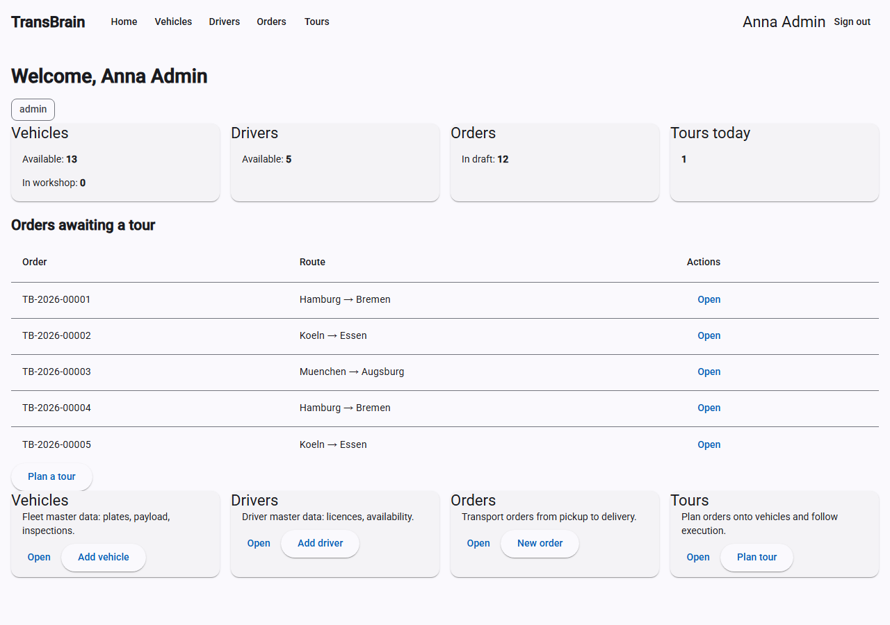
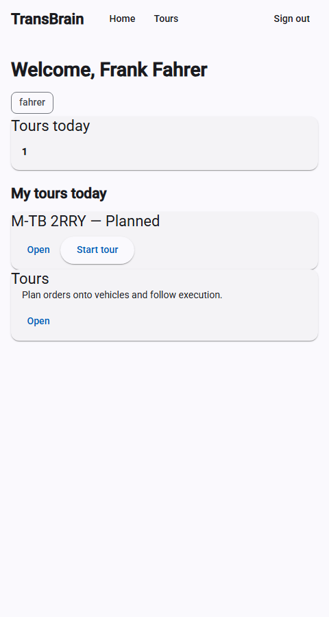
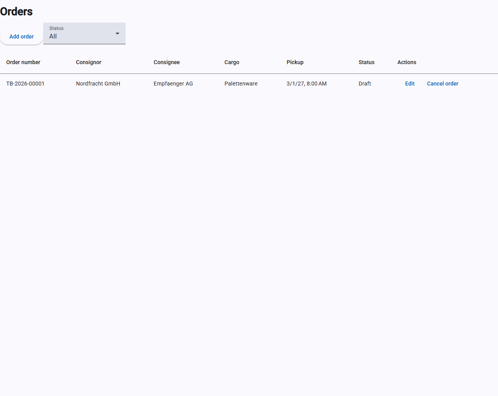
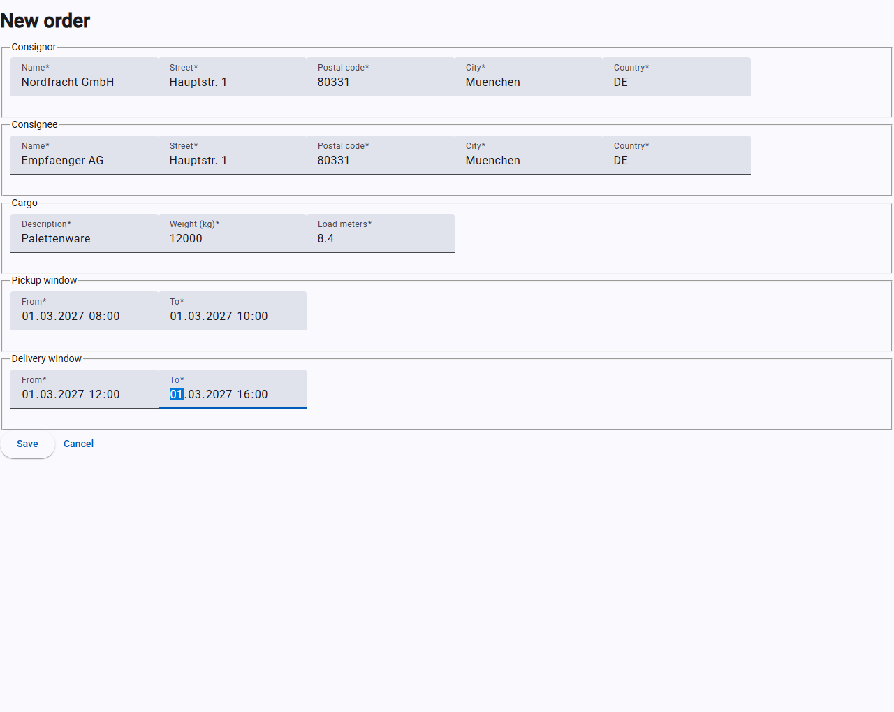
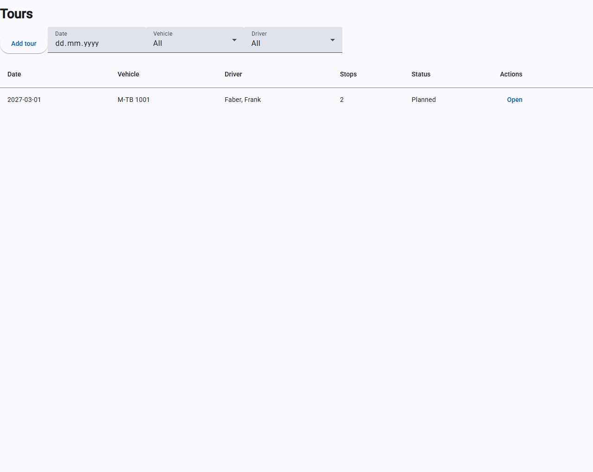
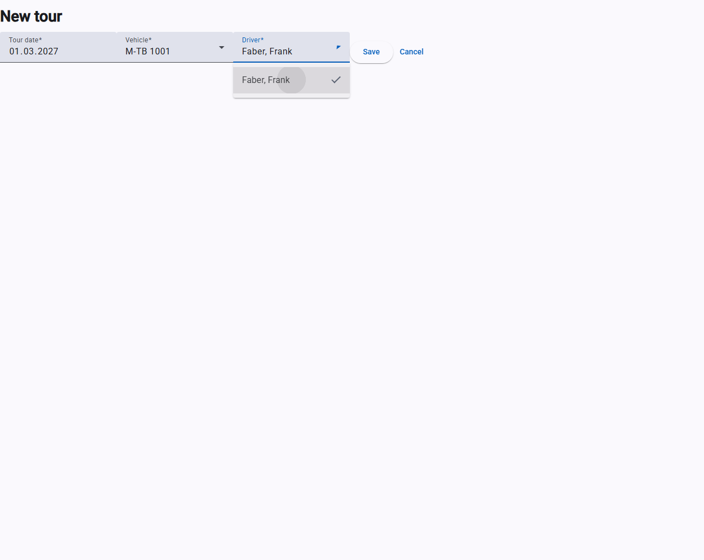
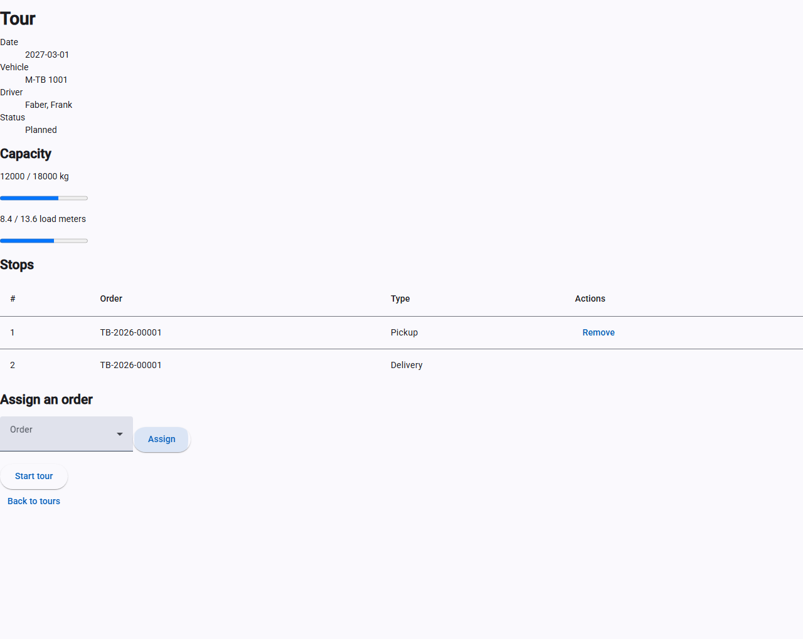

# Bedienung TransBrain.Web (Angular)

Diese Anleitung beschreibt die Angular-Oberfläche von TransBrain (`src/TransBrain.Web`).
Die zweite Oberfläche, TransBrain.VueWeb, bietet denselben Funktionsumfang gegen dieselbe
API — siehe `docs/BEDIENUNG_TRANSBRAIN_VUEWEB.md`.

Die Beschriftungen der Oberfläche selbst (Schaltflächen, Feldnamen, Fehlermeldungen) sind
auf Englisch, da die Anwendung noch nicht lokalisiert ist. Diese Anleitung ist auf Deutsch
verfasst, nennt aber die tatsächlichen englischen Beschriftungen, damit sie zu dem passt,
was auf dem Bildschirm zu sehen ist.

> **Achtung — Entwicklungsumgebung, keine Daten bleiben erhalten:** Bei jedem Neustart
> von `dotnet run --project src/TransBrain.AppHost` beginnt die Anwendung mit einer
> **leeren Datenbank**. Postgres und Keycloak haben in dieser Umgebung absichtlich kein
> dauerhaftes Datenlaufwerk — Postgres führt bei jedem Start alle Migrationen neu von
> Grund auf aus, und Keycloak importiert die Realm-Konfiguration erneut aus der Datei.
> Das macht jeden Start reproduzierbar, bedeutet aber auch: **Jedes Fahrzeug, jeder
> Fahrer und jede Änderung, die Sie über die Keycloak-Verwaltungskonsole vornehmen, geht
> beim nächsten Neustart verloren.** Tragen Sie hier keine Daten ein, auf deren
> Fortbestand Sie sich verlassen — das gilt auch für eine ganze Vormittagsarbeit an
> Stammdaten.

## Voraussetzungen

- Der gesamte Stack läuft (`dotnet run --project src/TransBrain.AppHost`), siehe
  README.md.
- Ein gültiges Benutzerkonto in Keycloak. Für die lokale Entwicklung siehe die
  Testbenutzer in README.md, Abschnitt „Test users“ — je einer pro Rolle
  (`admin`, `disponent`, `fahrer`, `viewer`).
- Die Anwendung ist unter `http://localhost:4200` erreichbar (Port siehe Aspire-Dashboard,
  falls abweichend).

## Anmeldung

1. `http://localhost:4200` im Browser öffnen.
2. Ohne aktive Sitzung zeigt die Seite nur eine Schaltfläche **„Sign in“**. Es gibt keine
   Fahrzeug- oder Fahrerliste zu sehen, bevor eine Anmeldung stattgefunden hat.
3. Klick auf „Sign in“ leitet zur Keycloak-Anmeldeseite weiter (Benutzername/Passwort).
4. Nach erfolgreicher Anmeldung erfolgt die Rückleitung zu TransBrain.Web, und die
   **Startseite** wird angezeigt — siehe das gleichnamige Kapitel unten.
5. Schlägt die Anmeldung fehl oder ist Keycloak nicht erreichbar, erscheint die Meldung
   „Could not verify your sign-in status. Please try signing in again.“

**Hinweis für die Fehlersuche:** Wenn die Anmeldung überhaupt nicht bis zur
Keycloak-Login-Seite kommt, ist meist das lokale HTTPS-Entwicklungszertifikat nicht als
vertrauenswürdig hinterlegt — siehe README.md, Abschnitt „Trust the development HTTPS
certificate“.

## Startseite

Nach der Anmeldung landen Sie auf der Startseite. Sie zeigt genau die Bereiche und
Schaltflächen, die Ihre Rolle benötigt — eine Fahrerin sieht dort etwas anderes als ein
Administrator. Über die Kopfleiste erreichen Sie dieselben Bereiche jederzeit wieder; ganz
rechts stehen Ihr Name und die Schaltfläche **„Sign out"** zum Abmelden.

Der obere Bereich zeigt Kennzahlen, darunter folgen die Arbeitslisten und ganz unten die
Kacheln, über die Sie in die einzelnen Bereiche springen. Welche Rolle was sieht:

| Bestandteil | admin | disponent | fahrer | viewer |
|---|:-:|:-:|:-:|:-:|
| Kennzahlen zu Fahrzeugen und Fahrern | ✓ | ✓ | | ✓ |
| Kennzahl „Orders in draft" (ungeplante Aufträge) | ✓ | ✓ | | ✓ |
| Kennzahl „Tours today" | ✓ | ✓ | ✓ (eigene) | ✓ |
| Liste „Orders awaiting a tour" mit **„Plan a tour"** | ✓ | ✓ | | |
| Liste „My tours today" mit **„Start tour"** / **„Complete tour"** | | | ✓ | |
| Kacheln Vehicles, Drivers, Orders | ✓ | ✓ | | ✓ |
| Kachel Tours | ✓ | ✓ | ✓ | ✓ |
| Schaltflächen **„Add vehicle"** / **„Add driver"** | ✓ | | | |
| Schaltflächen **„New order"** / **„Plan tour"** | ✓ | ✓ | | |

Für eine Fahrerin ist die Seite bewusst schmal gehalten, damit sie auf einem Mobiltelefon
im Fahrerhaus bedienbar bleibt. Sie zeigt nur die eigenen Touren des Tages und erlaubt es,
sie direkt zu starten und abzuschließen, ohne den Umweg über die Tourenliste. Bei geringer
Bildschirmbreite blendet die Kopfleiste den Namen aus, damit die Navigation Platz behält.

**Wichtig — der Unterschied zwischen „ausgeblendet" und „verboten":** Dass eine Kachel
fehlt, heißt nicht, dass Ihnen der Bereich verwehrt wäre. Alle vier Rollen dürfen alle
Listen lesen; ausgeblendet wird, was Ihre Rolle für ihre Arbeit nicht braucht. Geben Sie
etwa als Fahrerin `/vehicles` von Hand in die Adresszeile ein, sehen Sie die Fahrzeugliste.
Anders bei den Schaltflächen zum Anlegen, Ändern und Löschen: Die erscheinen nur, wenn Sie
die Änderung auch tatsächlich vornehmen dürfen. Rufen Sie ein Formular über die Adresszeile
auf, für das Ihnen die Berechtigung fehlt, bringt die Anwendung Sie zur Startseite zurück.

## Fahrzeugliste

Erreichbar über `/vehicles` oder die Kachel **Vehicles** auf der Startseite.

- Angezeigte Spalten: License plate (Kennzeichen), Type (Fahrzeugtyp), Payload (kg)
  (Zuladung).
- Schaltfläche **„Add vehicle“** oberhalb der Tabelle legt ein neues Fahrzeug an.
- Pro Zeile: **„Edit“** öffnet das Fahrzeug zum Bearbeiten, **„Delete“** löscht es sofort
  (ohne Rückfrage-Dialog).

**Bekannte Einschränkungen der Liste (Stand dieser Phase):**

- Es gibt weder eine Filter- noch eine Sortiermöglichkeit in der Oberfläche. Die API
  unterstützt zwar Filter nach Status und Typ sowie Seitenweise-Abruf, aber die Oberfläche
  ruft immer nur die erste Seite mit der Standardgröße ab. Bei mehr als 20 Fahrzeugen sind
  ältere Einträge in dieser Ansicht **nicht sichtbar**.
- Es gibt noch keine Navigation (kein Menü) zwischen der Fahrzeug- und der Fahrerliste.
  Um die Fahrerliste zu öffnen, muss die Adresse `/drivers` direkt in der Adressleiste des
  Browsers eingegeben werden.

## Fahrzeugformular (Anlegen / Bearbeiten)

Erreichbar über „Add vehicle“ (neu, `/vehicles/new`) oder „Edit“ in der Liste
(`/vehicles/{id}`).

| Feld (Beschriftung)  | Bedeutung                       | Pflichtfeld | Regeln                                  |
|----------------------|----------------------------------|:-----------:|------------------------------------------|
| License plate        | Kennzeichen                      | ja          | muss eindeutig sein (siehe unten)         |
| Type                 | Fahrzeugtyp                      | ja          | Auswahl: Tractor, RigidTruck, Van         |
| Payload (kg)         | Zuladung in Kilogramm            | ja          | muss größer als 0 sein                    |
| Load meters          | Lademeter                        | ja          | muss größer als 0 sein                    |
| Next inspection due  | Datum der nächsten Untersuchung  | ja          | Datum                                     |

- **„Save“** speichert; bei Erfolg erfolgt die Rückkehr zur Liste.
- **„Cancel“** verwirft die Eingabe und kehrt ohne Speichern zur Liste zurück.
- Ein leer gelassenes Pflichtfeld zeigt nach einem Speicherversuch direkt unter dem Feld
  „This field is required.“
- Lehnt die API die Eingabe ab (z. B. ein bereits vergebenes Kennzeichen, oder Zuladung
  bzw. Lademeter mit 0 oder weniger), erscheint die Fehlermeldung der API direkt unter dem
  betroffenen Feld — bei einem doppelten Kennzeichen z. B. eine Konfliktmeldung
  (HTTP 409).
- Ein Ladefehler beim Öffnen zum Bearbeiten (z. B. wenn das Fahrzeug zwischenzeitlich
  gelöscht wurde) erscheint als Meldung oberhalb des Formulars.

## Fahrerliste

Erreichbar nur über die direkte Eingabe von `/drivers` in der Adressleiste (siehe
„Bekannte Einschränkungen“ oben — es gibt noch keinen Menüpunkt dafür).

- Angezeigte Spalten: Last name (Nachname), First name (Vorname), License classes
  (Führerscheinklassen), Status.
- Schaltfläche **„Add driver“** legt einen neuen Fahrer an.
- Pro Zeile: **„Edit“** und **„Delete“**, wie bei Fahrzeugen.
- Dieselben Einschränkungen wie bei der Fahrzeugliste gelten auch hier (keine Filter,
  keine Sortierung, nur die erste Seite von bis zu 20 Einträgen).

## Fahrerformular (Anlegen / Bearbeiten)

Erreichbar über „Add driver“ (neu, `/drivers/new`) oder „Edit“ in der Liste
(`/drivers/{id}`).

| Feld (Beschriftung)  | Bedeutung                          | Pflichtfeld | Regeln                                   |
|----------------------|--------------------------------------|:-----------:|--------------------------------------------|
| First name           | Vorname                              | ja          | darf nicht leer sein                       |
| Last name            | Nachname                             | ja          | darf nicht leer sein                       |
| License classes      | Führerscheinklassen (Kontrollkästchen: B, C1, C, CE) | ja | mindestens eine Klasse muss ausgewählt sein |
| License valid until  | Gültig bis (Datum)                   | ja          | Datum                                      |

- Führerscheinklassen werden über Kontrollkästchen aus- bzw. abgewählt, nicht über ein
  Dropdown.
- **„Save“** und **„Cancel“** verhalten sich wie im Fahrzeugformular.
- Validierungsfehler (fehlende Pflichtfelder, keine Führerscheinklasse ausgewählt) und
  serverseitige Fehler werden auf dieselbe Weise wie im Fahrzeugformular direkt am
  betroffenen Feld angezeigt.

## Auftragsliste

Erreichbar über `/orders`.

- Angezeigte Spalten: Order number (Auftragsnummer), Consignor (Absender), Consignee
  (Empfänger), Cargo (Ladung), Pickup (Beginn des Abholfensters), Status.
- Die **Auftragsnummer wird vom Server vergeben**, im Format `TB-2027-00042` — Jahr und
  eine fortlaufende Nummer innerhalb dieses Jahres. Sie kann nicht eingegeben oder
  geändert werden, auch nicht beim Bearbeiten.
- Schaltfläche **„Add order“** oberhalb der Tabelle legt einen neuen Auftrag an.
- Das Auswahlfeld **„Status“** filtert die Liste. „All“ zeigt alle Aufträge; die übrigen
  Einträge entsprechen den fünf Status `Draft`, `Planned`, `InTransit`, `Delivered` und
  `Cancelled`.
- Pro Zeile: **„Edit“** öffnet den Auftrag zum Bearbeiten, **„Cancel order“** storniert
  ihn.

**Stornieren ist kein Löschen.** Ein Auftrag wird nie entfernt. Nach dem Stornieren
bleibt die Zeile in der Liste stehen, ihr Status wechselt lediglich auf `Cancelled`. Das
ist beabsichtigt: Das Unternehmen behält den Nachweis über einen erteilten und wieder
zurückgezogenen Auftrag — für Rückfragen zur Abrechnung und weil die Auftragsnummer dem
Kunden gegenüber bereits genannt wurde.

**Sicherheitsabfrage beim Stornieren:** Anders als beim Löschen von Fahrzeugen und
Fahrern wird hier nachgefragt. Ein Klick auf „Cancel order“ ersetzt die Schaltfläche in
derselben Zeile durch **„Confirm cancel“** und **„Keep order“**. Erst „Confirm cancel“
storniert tatsächlich; „Keep order“ bricht ab und ändert nichts.

## Auftragsformular (Anlegen / Bearbeiten)

Erreichbar über „Add order“ (`/orders/new`) oder „Edit“ (`/orders/{id}`).

Das Formular ist in fünf Abschnitte gegliedert:

| Abschnitt       | Felder                                   | Pflicht | Hinweise                                                     |
|-----------------|------------------------------------------|:-------:|---------------------------------------------------------------|
| Consignor       | Name, Street, Postal code, City, Country | ja      | Country ist ein zweibuchstabiger Ländercode nach ISO 3166-1, z. B. `DE`. Vorbelegt mit `DE`. |
| Consignee       | Name, Street, Postal code, City, Country | ja      | dieselben Regeln wie beim Absender                            |
| Cargo           | Description, Weight (kg), Load meters    | ja      | Gewicht und Lademeter müssen größer als null sein. Lademeter dürfen Dezimalstellen haben (z. B. `8.4`). |
| Pickup window   | From, To                                 | ja      | Datum **und** Uhrzeit; „From“ muss vor „To“ liegen            |
| Delivery window | From, To                                 | ja      | Datum **und** Uhrzeit; „From“ muss vor „To“ liegen            |

- Die Zeitfenster werden in Ihrer lokalen Zeit eingegeben und angezeigt, intern aber in
  UTC gespeichert. Beim erneuten Öffnen zum Bearbeiten erscheinen wieder dieselben
  Uhrzeiten, die Sie eingegeben haben.
- **Das Lieferfenster darf nicht beginnen, bevor das Abholfenster endet.** Ist das doch
  der Fall, lehnt der Server das Speichern ab und zeigt oberhalb des Formulars die
  Meldung „The delivery window must not start before the pickup window ends.“
- **„Save“** und **„Cancel“** verhalten sich wie im Fahrzeug- und Fahrerformular.
- Validierungsfehler werden direkt am betroffenen Feld angezeigt, auch bei den
  verschachtelten Adressfeldern (z. B. eine Meldung unter „Consignor → Name“).

## Auftragsstatus: welche Schritte abgelehnt werden

Dies ist der Teil, der im Alltag am ehesten für Verwirrung sorgt: Nicht jede Aktion ist in
jedem Status erlaubt. Ein Auftrag durchläuft die Status
`Draft` → `Planned` → `InTransit` → `Delivered`.

| Status      | Bearbeiten („Edit“ → „Save“) | Stornieren („Cancel order“) |
|-------------|:----------------------------:|:---------------------------:|
| `Draft`     | ja                           | ja                          |
| `Planned`   | **nein**                     | ja                          |
| `InTransit` | **nein**                     | **nein**                    |
| `Delivered` | **nein**                     | **nein**                    |
| `Cancelled` | **nein**                     | **nein**                    |

**Was Sie bei einer Ablehnung sehen:**

- **Bearbeiten eines Auftrags, der kein Entwurf mehr ist:** Das Formular lässt sich
  weiterhin öffnen und ausfüllen, aber beim Klick auf „Save“ erscheint oberhalb des
  Formulars die Meldung „An order in status 'Planned' can no longer be edited. (HTTP
  409)“ — mit dem jeweils tatsächlichen Status. Die Änderung wird **nicht** gespeichert,
  und die Anwendung kehrt nicht zur Liste zurück.
- **Stornieren eines Auftrags, der bereits unterwegs ist:** Nach „Confirm cancel“
  erscheint oberhalb der Tabelle die Meldung „An order in status 'InTransit' cannot move
  to 'Cancelled'. (HTTP 409)“. Die Tabelle bleibt sichtbar, der Auftrag unverändert.
- **Erneutes Stornieren eines bereits stornierten Auftrags:** dieselbe Meldung, mit
  `'Cancelled'` als aktuellem Status.

Das ist jeweils kein Fehler der Anwendung, sondern die beabsichtigte Regel: Sobald die
Ware physisch unterwegs ist, beschreibt der Auftrag einen realen Vorgang, der sich nicht
mehr per Mausklick zurücknehmen lässt. Die Schaltflächen werden dabei bewusst **nicht**
ausgeblendet — Sie erhalten stattdessen eine Meldung, die den Grund nennt.

**Hinweis:** Die Übergänge nach `Planned`, `InTransit` und `Delivered` sind in dieser
Phase noch nicht über die Oberfläche auslösbar; sie entstehen in einer späteren Phase
durch die Tourenplanung. In der Praxis sehen Sie hier daher zunächst nur `Draft` und
`Cancelled`.

## Tourenliste

Erreichbar über `/tours`.

Eine **Tour** ist die Tagesarbeit eines Fahrzeugs mit einem Fahrer: eine geordnete Liste von
Stopps, die eine Menge von Aufträgen bedient.

- Angezeigte Spalten: Date (Tourdatum), Vehicle (Kennzeichen), Driver (Fahrer), Stops (Anzahl
  der Stopps), Status.
- Schaltfläche **„Add tour“** oberhalb der Tabelle plant eine neue Tour.
- Drei Filter: **Date**, **Vehicle** und **Driver**. Sie wirken gemeinsam.
- Pro Zeile öffnet **„Open“** die Detailseite — dort findet die eigentliche Arbeit statt.

## Tourenformular (Anlegen)

Erreichbar über „Add tour“ (`/tours/new`).

| Feld       | Bedeutung                          | Pflicht |
|------------|------------------------------------|:-------:|
| Tour date  | Datum, an dem die Tour gefahren wird | ja     |
| Vehicle    | Fahrzeug aus dem Fahrzeugstamm      | ja      |
| Driver     | Fahrer aus dem Fahrerstamm          | ja      |

Nach dem Speichern landen Sie **direkt auf der Detailseite** der neuen Tour, nicht in der Liste —
der nächste Schritt ist immer, Aufträge zuzuordnen.

**Eine Tour lässt sich nachträglich nicht umplanen.** Es gibt bewusst kein Bearbeiten-Formular:
Fahrzeug, Fahrer und Datum stehen mit dem Anlegen fest. Wurde falsch geplant, entfernen Sie die
Aufträge wieder (sie werden dadurch erneut disponierbar) und legen eine neue Tour an.

### Welche Kombinationen abgelehnt werden

Beim Speichern prüft der Server vier Regeln. Jede Ablehnung erscheint als Meldung oberhalb des
Formulars, und das Formular bleibt stehen — Ihre Eingaben gehen nicht verloren.

| Situation                                                | Meldung (sinngemäß)                                                            |
|----------------------------------------------------------|--------------------------------------------------------------------------------|
| Fahrzeug steht in der Werkstatt oder ist ausgemustert     | „Vehicle 'M-AB 1234' is 'InWorkshop' and cannot be assigned to a tour. (HTTP 409)“ |
| Fahrer ist abwesend oder inaktiv                          | „Driver 'Fahrer' is 'Absent' and cannot be assigned to a tour. (HTTP 409)“      |
| Führerschein läuft **vor** dem Tourdatum ab               | „The driver's licence expires on 2027-02-28, before the tour date 2027-03-01. (HTTP 409)“ |
| Fahrzeug hat an diesem Datum bereits eine Tour            | „That vehicle already has a tour on 2027-03-01. (HTTP 409)“                     |
| Fahrer hat an diesem Datum bereits eine Tour              | „That driver already has a tour on 2027-03-01. (HTTP 409)“                      |

**Zum Führerschein:** Ein Schein, der **genau am** Tourdatum abläuft, ist an diesem Tag noch
gültig — die Tour wird angenommen. Erst ab dem Folgetag lehnt der Server ab.

**Zur Doppelbuchung:** Sie gilt pro Kalendertag und ohne Ausnahme — auch eine bereits
abgeschlossene Tour belegt Fahrzeug und Fahrer für diesen Tag.

## Tourendetail

Erreichbar über „Open“ in der Liste (`/tours/{id}`).

Die Seite gliedert sich in vier Bereiche:

**1. Kopfdaten** — Datum, Fahrzeug, Fahrer und Status der Tour.

**2. Capacity (Auslastung)** — zwei Anzeigen mit Balken:

- `12000 / 18000 kg` — zugeladenes Gewicht gegen die Nutzlast des Fahrzeugs
- `8.4 / 13.6 load meters` — belegte Lademeter gegen die verfügbaren

Diese Zahlen sind der Grund, warum die Seite existiert: Sie sehen **vor** dem Zuordnen, wie viel
Luft noch bleibt.

**3. Stops** — die Stoppliste in Reihenfolge. Je zugeordnetem Auftrag entstehen **automatisch
zwei** Stopps: ein `Pickup` (Abholung) und ein `Delivery` (Zustellung), wobei die Abholung immer
die kleinere Nummer trägt. Die Schaltfläche **„Remove“** an der Abholzeile nimmt den ganzen
Auftrag wieder von der Tour; die verbleibenden Stopps werden lückenlos neu nummeriert.

**4. Assign an order (Auftrag zuordnen)** — ein Auswahlfeld mit den zuordenbaren Aufträgen und
die Schaltfläche **„Assign“**.

**Angeboten werden nur Aufträge im Status `Draft`.** Jeder andere Status würde vom Server
abgelehnt, und eine Auswahl anzubieten, die anschließend abgelehnt wird, ist schlechter, als sie
gar nicht anzubieten. Ein Auftrag, der bereits auf einer anderen Tour liegt, ist deshalb nicht in
der Liste.

Darunter erscheinen je nach Status die Schaltflächen **„Start tour“** (nur bei `Planned`) und
**„Complete tour“** (nur bei `InProgress`). Schaltflächen, die im aktuellen Status ohnehin
abgelehnt würden, werden hier ausgeblendet — anders als beim Stornieren eines Auftrags, wo die
Ablehnung die Regel erklärt.

### Was beim Zuordnen abgelehnt wird

| Situation                                                     | Meldung (sinngemäß)                                                              |
|---------------------------------------------------------------|----------------------------------------------------------------------------------|
| Gewicht der Tour überschreitet die Nutzlast                    | „Adding this order would load 21000 kg onto a vehicle rated for 18000 kg. (HTTP 409)“ |
| Lademeter überschreiten die verfügbaren                        | „Adding this order would need 15.0 load meters on a vehicle offering 13.6. (HTTP 409)“ |
| Tour ist bereits gestartet oder abgeschlossen                  | „A tour in status 'InProgress' no longer accepts changes to its stops. (HTTP 409)“ |

**Wichtig:** Die Kapazität wird gegen die **Summe der gesamten Tour** geprüft, nicht nur gegen
den einzelnen Auftrag. Ein Auftrag, der allein passen würde, kann als dritter oder vierter
trotzdem abgelehnt werden. Die Anzeige unter „Capacity“ zeigt Ihnen vorher, wie viel bleibt.

## Tourstatus: welche Schritte abgelehnt werden

Eine Tour durchläuft `Planned` → `InProgress` → `Completed`.

| Status       | Aufträge zuordnen/entfernen | „Start tour“ | „Complete tour“ |
|--------------|:---------------------------:|:------------:|:---------------:|
| `Planned`    | ja                          | ja           | **nein**        |
| `InProgress` | **nein**                    | **nein**     | ja              |
| `Completed`  | **nein**                    | **nein**     | **nein**        |

- **Eine Tour ohne Stopps lässt sich nicht starten.** Sie erhalten „A tour without stops cannot
  be started. (HTTP 409)“. Das ist Absicht: Eine leere Tour würde Fahrzeug und Fahrer für den Tag
  binden, ohne etwas zu transportieren.

### Der wichtigste Zusammenhang: Tour und Auftrag hängen zusammen

Das Starten und Abschließen einer Tour **verändert die Aufträge mit**, ohne dass jemand die
Auftragsmaske öffnet:

| Aktion an der Tour        | Was mit jedem zugeordneten Auftrag geschieht |
|---------------------------|-----------------------------------------------|
| Auftrag zuordnen          | `Draft` → `Planned`                           |
| Auftrag entfernen         | `Planned` → `Draft` (wieder disponierbar)     |
| **„Start tour“**          | `Planned` → `InTransit`                       |
| **„Complete tour“**       | `InTransit` → `Delivered`                     |

Wenn Sie sich also wundern, warum ein Auftrag in der Auftragsliste plötzlich `InTransit` zeigt,
obwohl niemand ihn angefasst hat: Seine Tour wurde gestartet. Das ist der normale Weg — die
Auftragsmaske selbst kennt diese Übergänge gar nicht.

**Nebenwirkung, die überrascht:** Sobald eine Tour gestartet ist, sind ihre Aufträge `InTransit`
und lassen sich **nicht mehr stornieren und nicht mehr bearbeiten**. Wollen Sie einen Auftrag
noch ändern, tun Sie es vor dem Start der Tour — oder nehmen Sie ihn vorher von der Tour.

## Touren als Fahrer (`fahrer`)

Dies ist die erste Stelle im System, an der **zwei angemeldete Benutzer Unterschiedliches sehen**.

Ein Benutzer mit der Rolle `fahrer` sieht in der Tourenliste **ausschließlich seine eigenen
Touren** und kann auch nur diese starten und abschließen. Für Administratoren, Disponenten und
Betrachter gilt das nicht — sie sehen alle Touren.

**Der kurze Weg führt über die Startseite:** Ein Fahrer findet seine Touren des Tages dort unter
„My tours today“ und kann sie direkt starten und abschließen, ohne die Tourenliste zu öffnen. Die
Regeln unten gelten unverändert — die Startseite ist nur eine bequemere Tür zu denselben Aktionen.

- **Die Liste wird eingeschränkt, nicht verweigert.** Ein Fahrer, der `/tours` öffnet, sieht seine
  Touren. Filtert er ausdrücklich auf einen Kollegen, bleibt die Liste **leer** — das ist die
  wahrheitsgemäße Antwort auf „die Touren dieses Kollegen, unter meinen“.
- **Eine fremde Tour direkt aufzurufen wird abgelehnt.** `/tours/{id}` einer fremden Tour meldet
  „A driver may only see their own tours. (HTTP 403)“.
- **Start und Abschluss einer fremden Tour werden abgelehnt** mit „A driver may only start or
  complete their own tours. (HTTP 403)“.

**Voraussetzung:** Die Zuordnung läuft über das Feld **External user id** im Fahrerstamm, in dem
die Keycloak-Kennung (`sub`) des Fahrers hinterlegt wird. Ist dieses Feld leer, gehört der
Fahrerdatensatz zu **niemandem, der sich anmelden kann** — dessen Touren kann dann auch kein
Fahrer starten. Das ist Absicht: Ein leeres Feld als „passt zu jedem“ zu behandeln, würde die
Tour dem erstbesten Fahrer überlassen.

## Rollen und Rechte

Die Anmeldung erfolgt über Keycloak mit genau einer der vier Rollen `admin`,
`disponent`, `fahrer` oder `viewer`.

| Rolle       | Ansehen          | Fahrzeuge/Fahrer pflegen | Aufträge pflegen | Touren planen | Tour starten/abschließen |
|-------------|------------------|:------------------------:|:----------------:|:-------------:|:------------------------:|
| `admin`     | alles            | ja                       | ja               | ja            | ja                       |
| `disponent` | alles            | **nein**                 | **ja**           | **ja**        | **ja**                   |
| `fahrer`    | **nur eigene Touren** | **nein**            | **nein**         | **nein**      | **nur eigene**           |
| `viewer`    | alles            | **nein**                 | **nein**         | **nein**      | **nein**                 |

**Aufträge und Touren sind die Ausnahme von der Regel „nur `admin` darf schreiben“.** Ein
Disponent darf beides anlegen, ändern und stornieren beziehungsweise planen — das ist genau seine
Aufgabe. Bei Fahrzeugen und Fahrern (Stammdaten) darf er weiterhin nur lesen.

**Der Fahrer ist die zweite Ausnahme:** Er darf nichts anlegen, aber seine eigenen Touren starten
und abschließen — siehe Abschnitt „Touren als Fahrer“.

**Die Oberfläche bietet nur an, was Ihre Rolle auch darf.** Die Schaltflächen
„Add vehicle“/„Add driver“, „Edit“ und „Delete“ erscheinen ausschließlich für die Rolle
`admin`; „New order“, „Edit“, „Cancel order“ und „Plan tour“ nur für `admin` und
`disponent`; „Start tour“ und „Complete tour“ für `admin`, `disponent` und `fahrer`. Wer
eine Schaltfläche nicht sieht, dürfte sie ohnehin nicht benutzen.

Das **Lesen** ist davon unberührt: alle vier Rollen dürfen alle Listen ansehen, mit der
einen Ausnahme, dass ein Fahrer in der Tourenliste nur seine eigenen Touren sieht. Die
Navigation blendet für einen Fahrer die Bereiche Fahrzeuge, Fahrer und Aufträge aus, weil
er sie für seine Arbeit nicht braucht — über die Adresszeile bleiben sie erreichbar.

Sollten Sie dennoch eine Ablehnung mit `HTTP 403` sehen, ist das kein Bedienfehler: Es
bedeutet, dass sich Ihre Rechte seit dem Laden der Seite geändert haben. Ein Neuladen zeigt
dann die passende Oberfläche.

## Bekannte Einschränkungen (Zusammenfassung)

- Keine Sortierfunktion in der Oberfläche.
- Die Kennzahlen und Arbeitslisten der Startseite werden beim Öffnen einmal geladen; sie
  aktualisieren sich nicht von selbst, solange die Seite offen bleibt.
- Löschen von Fahrzeugen und Fahrern erfolgt sofort, ohne Sicherheitsabfrage; das
  Stornieren eines Auftrags fragt dagegen nach.
- In der Auftragsliste lässt sich nur nach Status filtern; die Filter nach Abholzeitraum,
  die die API anbietet, haben noch keine Bedienelemente.
- Eine Tour lässt sich nach dem Anlegen weder umplanen noch löschen. Eine falsch geplante Tour
  bleibt als leere Tour stehen, nachdem ihre Aufträge entfernt wurden — und belegt Fahrzeug und
  Fahrer für diesen Tag weiter.
- Die Listen zeigen bis zu 100 Einträge und haben keine Blätterfunktion; darüber hinaus sind
  ältere Einträge nicht erreichbar.
